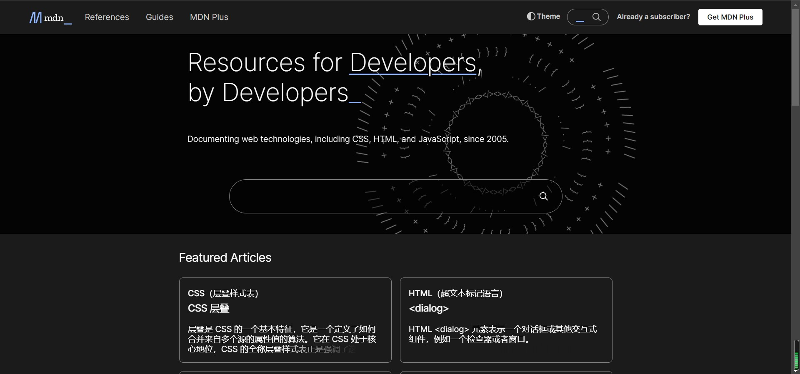
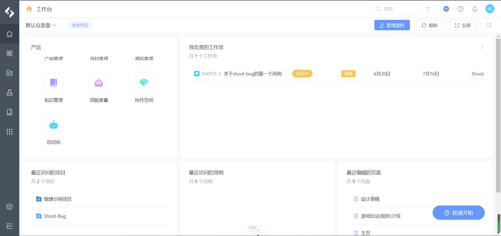
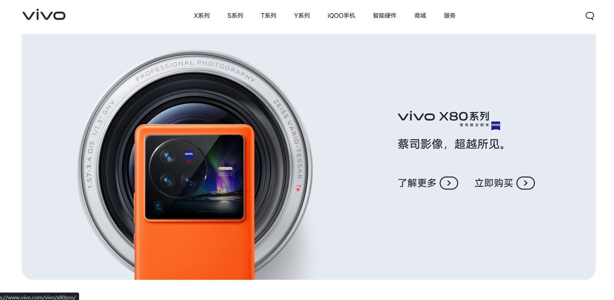

# hlz的独特审美学

## 介绍

在学习前端的过程中，讲师怎么教我们画一个div呢，是不是给个边框颜色，再给个背景色就好了，这容易导致我们在布局的时候也养成了这个习惯，当然这对工作是几乎没有影响的，因为工作上通常都会有一个已经设计好的页面图纸，我们只需要按照图纸一比一还原出来就好了。可是我们在做自己的作品的时候呢，没有图纸，我们只能凭借着自己的审美进行设计和完善，而我现在的审美意识可以说几乎为0，所以我创建这个仓库的意义就是想去培养自己的审美意识，我认为美这个东西没有标准，每个人都有自己对“美”的理解，就像你喜欢什么衣服一样，你觉得好看才买，别人觉得好不好看那是别人的事，所以也没有必要专门去看教程什么的。

## 各种整体布局

我所说的“布局”不是指流式布局，flex布局等，我指的是全局的一个布局模板，比如常规的**header+sidebar+content+footer**，如下图所示
  
市面上大部分的内部管理系统的网页都做成这个样子，似乎已经成了一种标准。我之前练手的项目中，竟然也无意识地用了这样的全局布局，可能是看过太多这样的布局，潜意识里认为网页布局应当就是这样子的。  
想一下我们穿的衣服，夏天因为天气炎热，所以我们穿短袖；冬天因为天气寒冷，所以我们穿羽绒服。网页应该也是这样的，根据业务种类的不同，网页布局也要做出相应调整。比如说，文档类的网站MDN  
  
可以看到，header下面是一个banner而不是传统的aside+content，事实上，很多电商类网站如淘宝，天猫等也是放一个banner，这种我们暂时叫**header+banner+content+footer**，但这个banner内容不要局限于轮播图(大部分电商网站的banner内容都是轮播图)，banner里的内容是你自己决定的，像MDN，Dribble等的banner是搜索框加一些title，再加上一个酷炫的gif动图作为背景。像大家来MDN基本上就是来查询一些前端技术的用法的，所以在banner突出搜索框是没毛病的设计。

再比如说，三国杀游戏网站的官网  

可以看到，header和sidebar直接没了，比较吸引眼球的是三国杀logo边上的美女是吧，很多游戏官网都会为了博人眼球，把精美的游戏人物作为背景并突出显示，而一些关于游戏的业务比如游戏资讯，活动中心等都会被做的比较小（可能没有比较小，只是因为背景太大了导致视觉效果上形成对比所以感觉它比较小）。然后网页往下拉可以看到三国杀的主内容，可以看到采用的是卡片式布局，非常的规整，所以我给这种模板取个名叫做**大背景+卡片式+footer**。  
还有一些网站，他们有两个header，一个主header，一个副header，比如pingcode的主页面  
  
还有唯品会的官网

可以看到，header竖着贴在了页面侧面，页面最上侧是一个副header，副header下面就是主内容。当功能非常多的时候，可以采用这种两个header的设计。

## content里的各种布局

### 卡片式布局

这三张分别是设计类，游戏类和电商类网站里的卡片式布局，足以说明现在卡片式布局有多流行。关于如何实现卡片式布局看[这里](./how_to_make_cardlayout.md)

### 分屏布局

分屏布局就是打广告，一个广告占一页，差不多可以这么理解。在手机类官网上十分常见。  

### 传统布局

就是普通的布局，没有明显特征，通常有线条划分区域。

